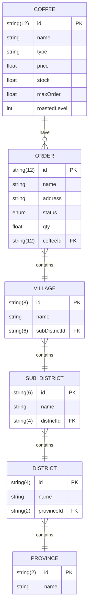

**Project Owner**: Kwanchai Eurviriyanukul

**Database Designed**: Methapon Metanipat, Kwanchai Eurviriyanukul

**UI Designed**: Puriphat Jirapornsawad, Kwanchai Eurviriyanukul

**API Designed**: Methapon Metanipat, Kwanchai Eurviriyanukul

**Developmen**t: Methapon Metanipat, Puriphat Jirapornsawad

